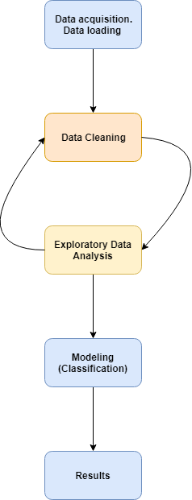
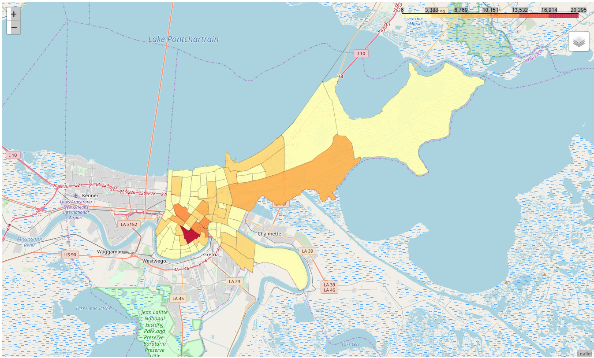

Exploratory Data Analysis and predicting outcomes from Stanford Open Policing Data
===============
###### _All data here presented can be obtained on the website:_ (https://openpolicing.stanford.edu)

This is a personal project which in I do a brief Exploratory Data Analysis (EDA) on the Stanford Open Policing Data as well as try to predict the outcome from the police activity for the city of New Orleans.

For this project I used Python and the following libraries:
- Pandas
- Numpy
- Json
- Matplotlib
- Seaborn
- Folium
- Shapely
- Scikit-learn

Here is the workflow of this project: 

Following the workflow, the first step in this project was to obtain the database and load it into a Jupyter Notebook. 

After this, I observed how the data was stored and how the information was distributed using some methods of the Pandas library. I cleaned-up and organized the data so I could use it to the analysis later on.

The third step was the basic exploratory data analysis. From the dataset, I plotted some graphics to have a better understanding of how all the information was arranged. It is common that data scientists find something to correct during this process what leads them to the cleaning part of the process again (see workflow). Take a look at one of the figures we created using Folium and Shapely:

Continuing the workflow, the next phase is called modeling. I decided to use four models from the scikit-learn library: 
- KneighborsClassifier - KNN
- LogisticRegression
- Support Vector Classification - SVC
- DecisionTreeClassifier

Finally, we presented the results obtained.
